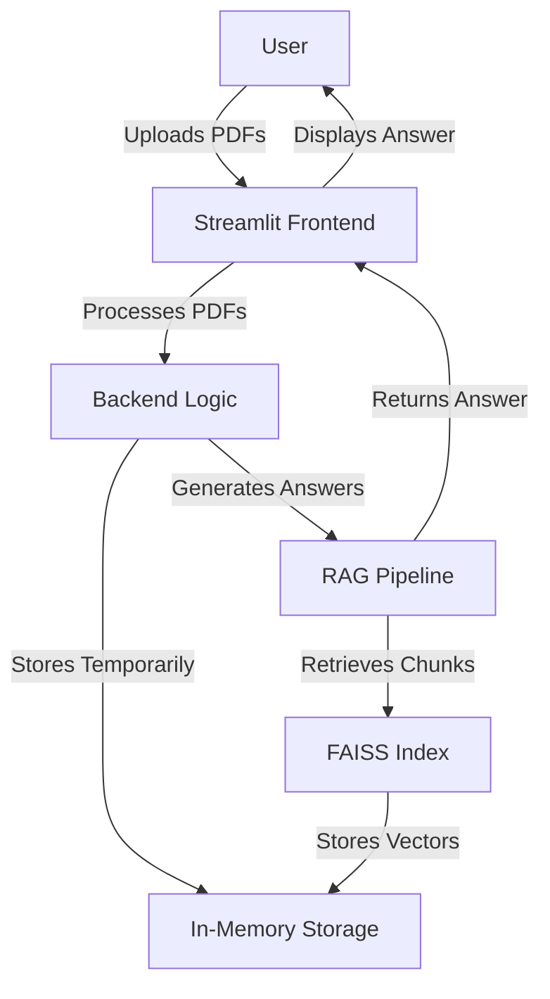

# Architecture Document: PDF RAG Chat MVP

## 1. Introduction

This Architecture Document outlines the technical design for the PDF RAG Chat MVP, as specified in the Product Requirements Document (PRD). It provides a detailed blueprint for a chat application enabling users to upload up to three PDFs (<50 MB each) and query their content using Retrieval-Augmented Generation (RAG). The focus is on simplicity, speed, and usability.

**Note:** This document is based on the current PRD. Implementation findings (e.g., UI generation, initial coding) may lead to PRD refinements, requiring updates to this document for alignment.

## 2. Architectural Goals and Constraints

### Goals
- **Performance**: Answer generation within 5 seconds for standard PDFs (<50 MB, up to 3).
- **Usability**: Intuitive Streamlit UI with clear feedback for errors.
- **Testing**: ≥80% code coverage via unit tests; validate with e2e tests.
- **Simplicity**: Rapid development and deployment for MVP.

### Constraints
- **Technology Stack**: Python 3.10, Streamlit, LangChain, FAISS, Render, Pytest, Selenium.
- **Deployment**: Render free tier (limited memory, compute, connections).
- **Security**: HTTPS via Render; no authentication for MVP.
- **Storage**: Temporary in-memory storage; no persistent database.

## 3. Architectural Representation / Views

### High-Level Overview
The architecture is a **Monolith**, integrating frontend, backend, and data processing. This supports simplicity and Render’s free tier constraints.

**Justification**:
- PRD specifies a simple app, making a monolith efficient.
- Single-service minimizes resource usage.



### Component View
1. **Streamlit Frontend**:
   - **Responsibilities**: PDF uploads, question input, answer/source display.
   - **Interactions**: Sends PDFs/queries to Backend Logic; renders responses.

2. **PDF Processor**:
   - **Responsibilities**: Validates PDFs (type, size <50 MB, ≤3), extracts text, chunks for indexing.
   - **Interactions**: Receives PDFs from Frontend, passes chunks to RAG Logic.

3. **RAG Logic**:
   - **Responsibilities**: Processes queries, retrieves chunks via FAISS, generates answers with LangChain.
   - **Interactions**: Uses In-Memory Storage; returns answers to Frontend.

4. **In-Memory Storage**:
   - **Responsibilities**: Stores PDFs and FAISS indexes temporarily.
   - **Interactions**: Provides data to PDF Processor and RAG Logic.

### Data View
- **Entities**:
  - **PDF Documents**: Raw files in memory.
  - **Text Chunks**: Extracted, indexed in FAISS.
  - **User Queries**: Text input.
  - **Answers**: Responses with source attributions.
- **Storage**: In-memory; FAISS for vector indexes.
- **Database**: None (per PRD).

### Deployment View
- **Environment**: Render free tier, single web service with HTTPS.
- **CI/CD**: Optional GitHub Actions for automated deployment.

## 4. Initial Project Setup (Manual Steps)

**Story 0: Project Initialization**

1. **Create Directory**:
   - Command: `mkdir pdf_rag_chat && cd pdf_rag_chat`
   - Purpose: Project root setup.

2. **Virtual Environment**:
   - Command: `python3.10 -m venv venv`
   - Activate: `source venv/bin/activate` (Linux/Mac) or `venv\Scripts\activate` (Windows)
   - Purpose: Dependency isolation.

3. **Install Dependencies**:
   - Create `requirements.txt`:
     ```
     streamlit==1.38.0
     langchain==0.2.16
     faiss-cpu==1.8.0
     pypdf2==3.0.1
     pytest==8.3.3
     selenium==4.24.0
     ```
   - Command: `pip install -r requirements.txt`
   - Purpose: Exact version reproducibility.

4. **Initialize Streamlit**:
   - Create `app.py`:
     ```python
     import streamlit as st

     st.title("PDF RAG Chat")
     ```
   - Purpose: Frontend entry point.

5. **Testing Setup**:
   - Command: `mkdir tests && touch tests/__init__.py`
   - Purpose: Prepares test directory.

**Justification**: Manual setup ensures control for small-scale MVP with specific versions.

## 5. Technology Stack

- **Languages & Frameworks**:
  - Python 3.10.12
  - Streamlit 1.38.0

- **Libraries/Packages**:
  - LangChain 0.2.16 (RAG)
  - FAISS 1.8.0 (CPU, vector search)
  - PyPDF2 3.0.1 (PDF extraction)
  - Pytest 8.3.3 (unit testing)
  - Selenium 4.24.0 (e2e testing)

- **Database**: None (in-memory)

- **Infrastructure**: Render free tier

## 6. Patterns and Standards

- **Architectural Patterns**:
  - Monolith: Simplifies development/deployment.
  - Repository Pattern: Abstracts in-memory data access.

- **API Design**: Not applicable (no external APIs).

- **Coding Standards**:
  - **Style**: PEP 8
  - **Formatter**: Black
  - **Linter**: Flake8
  - **Naming**:
    - Functions/Variables: `snake_case`
    - Classes: `PascalCase`
    - Constants: `UPPER_CASE`
  - **Test Location**: `tests` directory, mirroring source.

- **Error Handling**:
  - Use `try-except` for critical operations.
  - Log with `logging` (console, file).
  - User-friendly UI messages.

## 7. Folder Structure

```
pdf_rag_chat/
├── app.py              # Streamlit entry point
├── rag_logic.py        # RAG pipeline
├── pdf_processor.py    # PDF validation/extraction
├── tests/              # Tests
│   ├── test_pdf.py     # PDF tests
│   └── test_e2e.py     # E2e tests
├── requirements.txt    # Dependencies
└── README.md           # Documentation
```

**Conventions**:
- Source in root for simplicity.
- Tests mirror source in `tests/`.

## 8. Testing Strategy

- **Test Types**:
  - Unit (Pytest)
  - End-to-End (Selenium)

- **Frameworks**:
  - Pytest 8.3.3
  - Selenium 4.24.0

- **Coverage**: ≥80% (unit tests)

- **Standards**:
  - AAA pattern for unit tests.
  - Mock dependencies (FAISS, LangChain).
  - Ensure test isolation.

## 9. Core AI Agent Rules

1. Place unit tests in `tests`, mirroring source (e.g., `tests/test_pdf.py`).
2. Follow PEP 8, enforced by Black/Flake8.
3. Use `snake_case` for functions/variables.
4. Include docstrings for functions (purpose, params, returns).
5. Follow DRY; abstract reusable logic.
6. Log errors with `logging`.
7. Maintain ≥80% test coverage.
8. Use type hints for functions.
9. Keep functions small, single-purpose.
10. Use descriptive variable names.

## 10. Security Considerations

- **HTTPS**: Via Render.
- **Validation**: PDF type, size (<50 MB), count (≤3).
- **Errors**: Avoid exposing sensitive details in UI.

No authentication required per PRD.

## 11. Architectural Decisions (ADRs)

**Decision**: Monolithic architecture
- **Context**: Simple MVP per PRD.
- **Rationale**: Simplifies development/deployment on Render.

**Decision**: In-memory storage
- **Context**: No persistent storage needed.
- **Rationale**: Reduces complexity.

## 12. Glossary

- **RAG**: Retrieval-Augmented Generation.
- **FAISS**: Facebook AI Similarity Search.
- **Streamlit**: Framework for ML/data apps.

